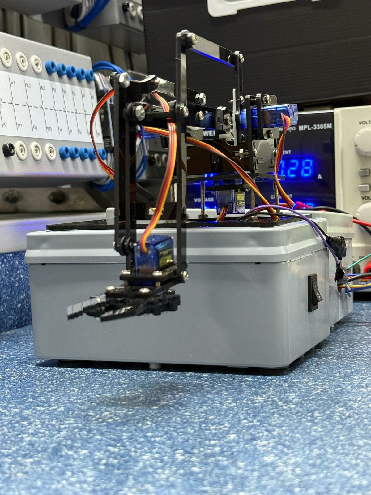
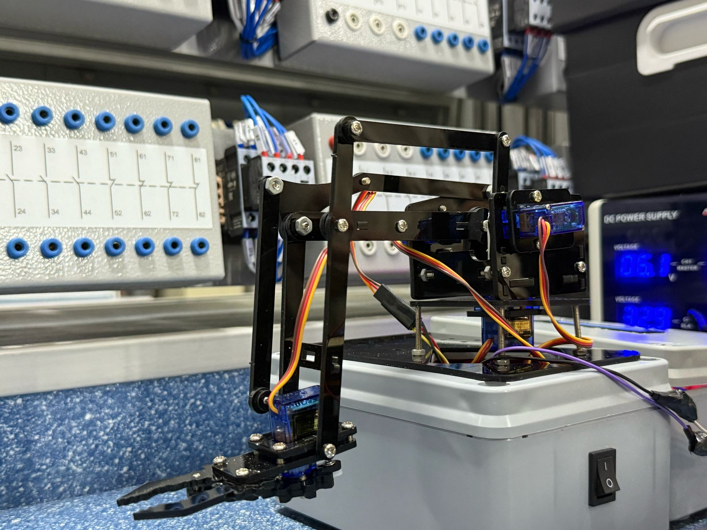
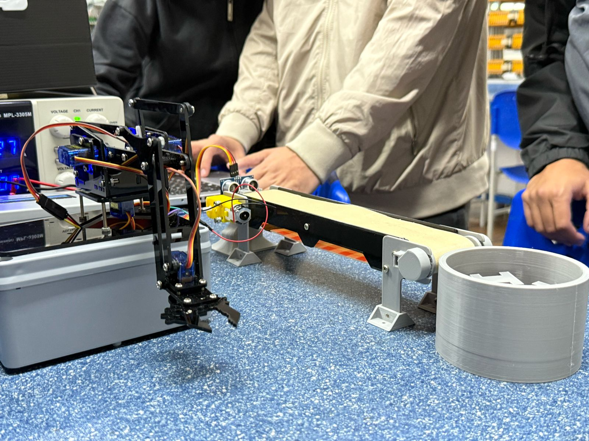

# 🤖 Projeto Braço Robótico com Controle Web – SENAI (Sistemas Embarcados)

Este repositório contém o código-fonte do projeto desenvolvido para a disciplina de **Sistemas Embarcados**, no **3º semestre do curso Técnico em Mecatrônica** pelo SENAI. O projeto consiste no controle de um braço robótico com quatro servomotores via interface web, utilizando o microcontrolador **ESP32** com ponto de acesso Wi-Fi embutido.

---

## 📸 Produto Final do Projeto

|  |    | 
|:--:|:--:|
|  |  |
---
## 📌 Objetivo do Projeto

Criar um sistema embarcado funcional que permita:

- Controlar remotamente um braço robótico de 4 graus de liberdade (base, braço 1, braço 2 e garra).
- Integrar sensores e atuadores em um sistema interativo.
- Utilizar o ESP32 como servidor web para interface de controle.
- Aplicar conceitos de automação, eletrônica e desenvolvimento web embarcado.

---

## ⚙️ Componentes Utilizados

| Componente           | Função                                        |
|----------------------|-----------------------------------------------|
| ESP32                | Microcontrolador principal com Wi-Fi         |
| Servo Motor x4       | Atuadores do braço (Base, Braço1, Braço2, Garra) |
| Sensor digital       | Gatilho para ciclo automático sensorizado    |
| Interface Web        | HTML/CSS/JS embarcado via ESP32              |
|Botões físicos | Realizam a função de emergência para a garra

---

## 🔧 Funcionalidades

- Interface Web para controle de cada servo com sliders.
- Botões para:
  - Ativar/Desativar o sistema
  - Enviar para **posição inicial (home)**
  - Iniciar **ciclo automático** (com sensor)
  - Parar o ciclo
- Feedback visual do status dos servos e estado do sensor no monitor serial.


---

## 🖥️ Interface Web

A interface HTML embarcada no ESP32 é responsiva e estilizada com CSS moderno. Permite:

- Controle de ângulos dos servos via sliders.
- Acompanhamento do estado do sistema.
- Experiência de usuário intuitiva com design customizado.

---

## 🧠 Lógica do Sistema

- O ESP32 atua como **Access Point (AP)** com SSID `LABAM-ROBOT` e senha `labam378`.
- Ao conectar-se, o usuário acessa a interface de controle.
- Requisições GET são interpretadas e os valores dos sliders atualizam os ângulos dos servos.
- Ciclo automático (comentado no código) pode ser reativado facilmente:
  ```cpp
  if(autoCycle && digitalRead(INPUT_SENSOR) == 1){
    // Executa sequência de posições pré-definidas
  }

---

## 📖 Documentação

- [Documentação do ESP-32](https://docs.espressif.com/projects/esp-idf/en/stable/esp32/index.html)
- [Documentação da biblioteca Wi-Fi](https://docs.arduino.cc/language-reference/en/functions/wifi/wificlass/)
- [Documentação do JavaScript](https://developer.mozilla.org/en-US/docs/Web/JavaScript)
- [Documentação do CSS](https://developer.mozilla.org/en-US/docs/Web/JavaScript)
- [Docummentação do HTML](https://developer.mozilla.org/pt-BR/docs/Web/HTML)

---

## 👨‍💻 Autor

**Matheus Passos Pechin Ronchi**  
  
📧 E-mail: [matheuspp.ronchi@gmail.com](mailto:matheuspp.ronchi@gmail.com)  
🔗 LinkedIn: [linkedin.com/in/matheus-ronchi-667b692b7](https://www.linkedin.com/in/matheus-ronchi-667b692b7/)  
💻 GitHub: [github.com/croassantpassos16](https://github.com/croassantpassos16)

---
